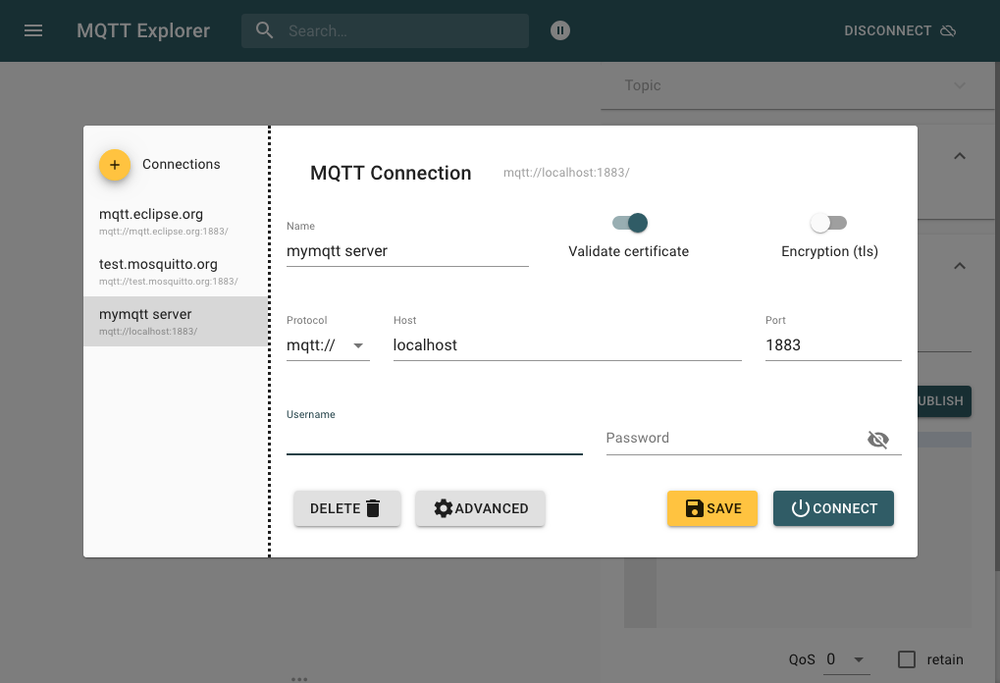
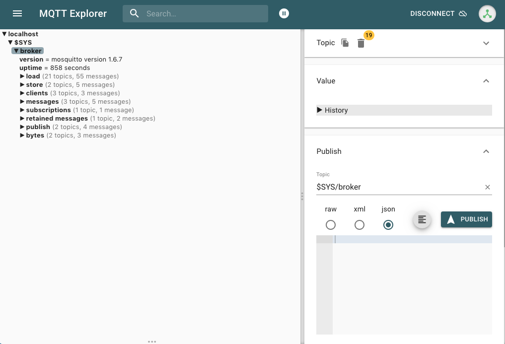

# Real Time Business

Online Event Processing Platform

## Prepared Enviroment

1- Download Mosquitto 

* Mosquitto from https://mosquitto.org/download/


```shell
$ brew install mosquitto

```
 
3- Running Mosquitto Server & Validated 

```shell
$ mosquitto -c /usr/local/etc/mosquitto/mosquitto.conf
1571104326: mosquitto version 1.6.7 starting
1571104326: Config loaded from /usr/local/etc/mosquitto/mosquitto.conf.
1571104326: Opening ipv6 listen socket on port 1883.
1571104326: Opening ipv4 listen socket on port 1883.
```

## Validate MQTT Server 

MQTTExplorer Detail 





### Reference

* https://mosquitto.org
* http://mqtt-explorer.com/


