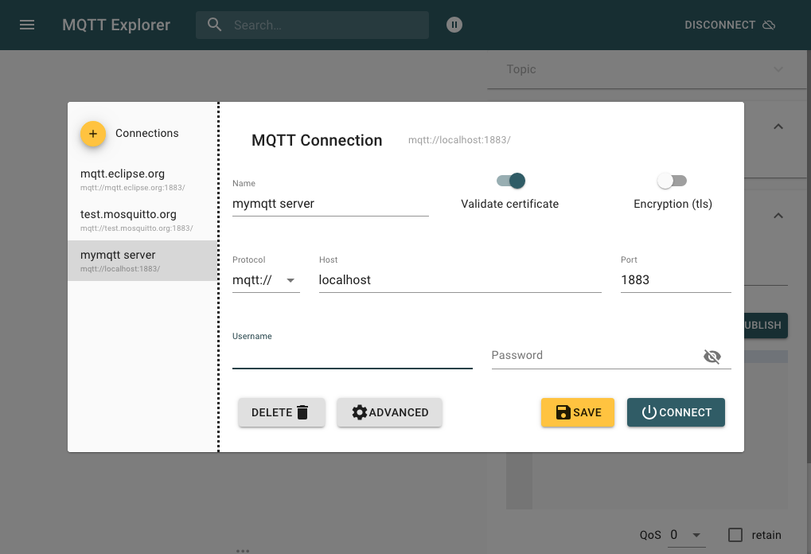
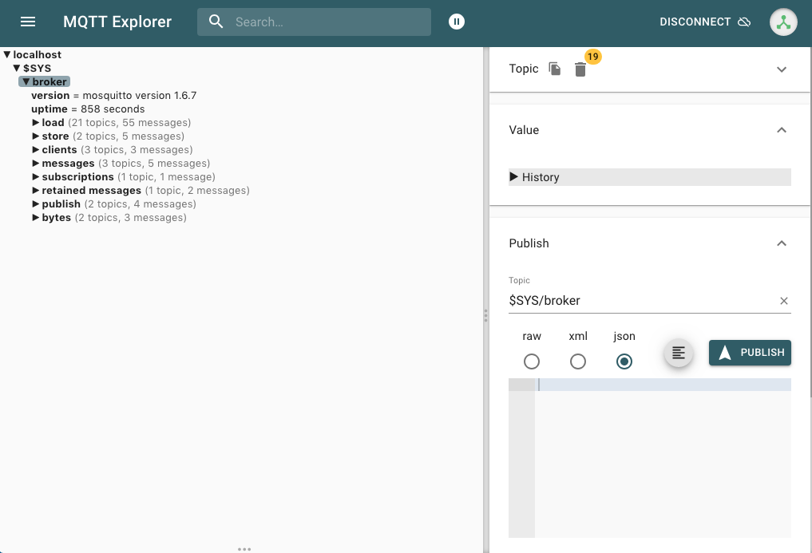
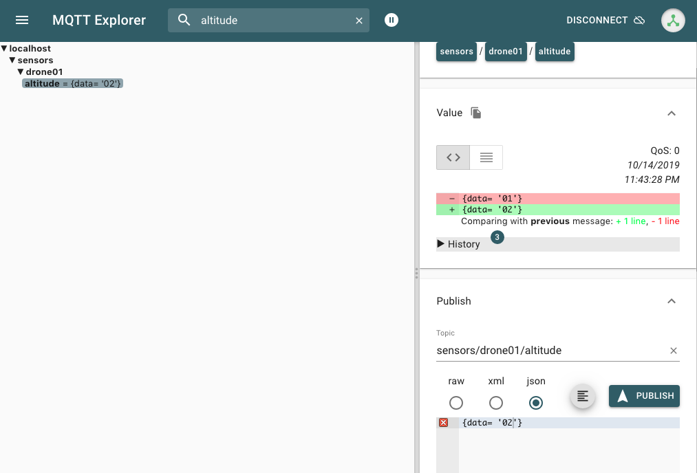

# Real Time Business

Online Event Processing Platform

## Prepared Enviroment

1- Download Mosquitto 

* Mosquitto from https://mosquitto.org/download/


```shell
$ brew install mosquitto

```
 
3- Running Mosquitto Server & Validated 

```shell
$ mosquitto -c /usr/local/etc/mosquitto/mosquitto.conf
1571104326: mosquitto version 1.6.7 starting
1571104326: Config loaded from /usr/local/etc/mosquitto/mosquitto.conf.
1571104326: Opening ipv6 listen socket on port 1883.
1571104326: Opening ipv4 listen socket on port 1883.
```

## Validate MQTT Server Running  

Install MQTTExplorer & Run 





4- Create Topic and Publish Message usgin MQTTExplorer 

```shell
$ mosquitto_sub -V mqttv5 -t sensors/drone01/altitude -d
Client (null) sending CONNECT
Client auto-9C02B3F0-F0E8-BA0B-D111-4F1588B59637 received CONNACK (0)
Client auto-9C02B3F0-F0E8-BA0B-D111-4F1588B59637 sending SUBSCRIBE (Mid: 1, Topic: sensors/drone01/altitude, QoS: 0, Options: 0x00)
Client auto-9C02B3F0-F0E8-BA0B-D111-4F1588B59637 received SUBACK
Subscribed (mid: 1): 0
Client auto-9C02B3F0-F0E8-BA0B-D111-4F1588B59637 received PUBLISH (d0, q0, r0, m0, 'sensors/drone01/altitude', ... (12 bytes))
{data= '01'}
Client auto-9C02B3F0-F0E8-BA0B-D111-4F1588B59637 received PUBLISH (d0, q0, r0, m0, 'sensors/drone01/altitude', ... (12 bytes))
{data= '02'}
```

Note : Using MQTTExplorer to Publish Message in sensors/drone01/altitude  




### Reference

* https://mosquitto.org
* http://mqtt-explorer.com/


